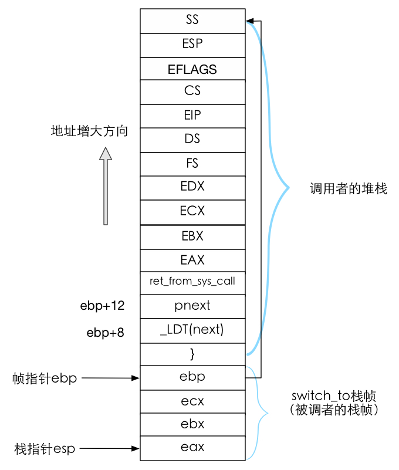
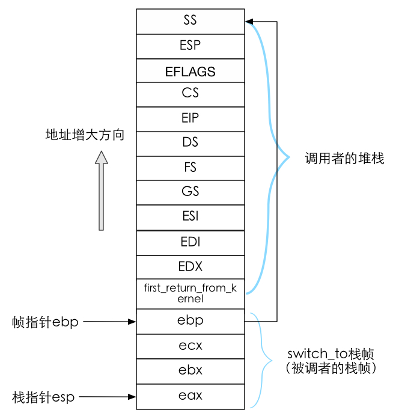
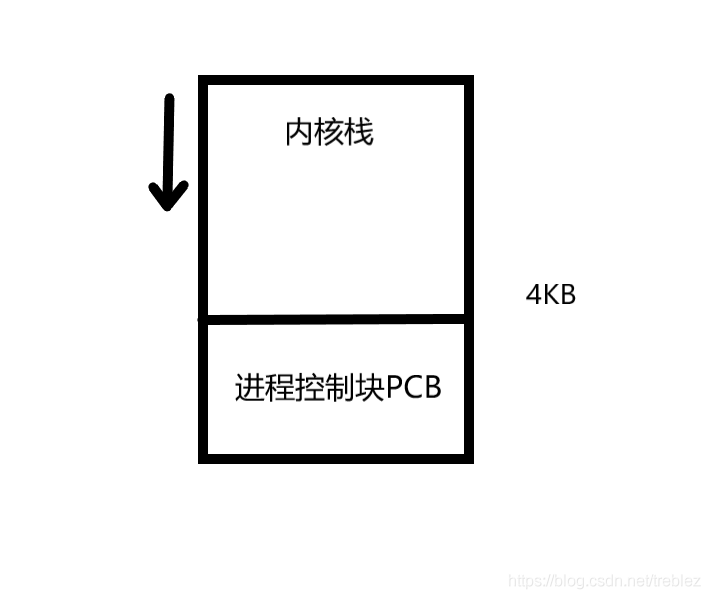

### 实验目的

- 深入理解进程和进程切换的概念；
- 综合应用进程、CPU 管理、PCB、LDT、内核栈、内核态等知识解决实际问题；
- 开始建立系统认识。

### 实验过程
1. 修改`kernal/sched.c`的switch_to调用

```c
if ((*p)->state == TASK_RUNNING && (*p)->counter > c)
    c = (*p)->counter, next = i, pnext = *p;

//.......

switch_to(pnext, _LDT(next));
```

2. 注释掉`include/linux/sched.h`中的switch_to宏

```c
//#define switch_to(n) {\
//struct {long a,b;} __tmp; \
//__asm__("cmpl %%ecx,current\n\t" \
//	"je 1f\n\t" \
//	"movw %%dx,%1\n\t" \
//	"xchgl %%ecx,current\n\t" \
//	"ljmp *%0\n\t" \
//	"cmpl %%ecx,last_task_used_math\n\t" \
//	"jne 1f\n\t" \
//	"clts\n" \
//	"1:" \
//	::"m" (*&__tmp.a),"m" (*&__tmp.b), \
//	"d" (_TSS(n)),"c" ((long) task[n])); \
//}
```

3. 实现新的switch_to方法

```asm
    pushl %ebp
    movl %esp,%ebp
```
这是在干什么？
[详细说明](https://segmentfault.com/a/1190000007977460)

[详细说明](https://www.cxymm.net/article/qq_42518941/119182097)

4. 修改`fork.c`中copy_process方法
[详细说明](https://blog.csdn.net/baidu_25130051/article/details/46670345)

去掉tss切换的部分, 通过krnstack切换（本实验的目的）

执行到switch_to的栈的样子


也就是说switch_to的ret会执行ret_from_sys_call

```asm
ret_from_sys_call:
	movl current,%eax		# task[0] cannot have signals
	cmpl task,%eax
	je 3f
	cmpw $0x0f,CS(%esp)		# was old code segment supervisor ?
	jne 3f
	cmpw $0x17,OLDSS(%esp)		# was stack segment = 0x17 ?
	jne 3f
	movl signal(%eax),%ebx
	movl blocked(%eax),%ecx
	notl %ecx
	andl %ebx,%ecx
	bsfl %ecx,%ecx
	je 3f
	btrl %ecx,%ebx
	movl %ebx,signal(%eax)
	incl %ecx
	pushl %ecx
	call do_signal
	popl %eax
3:	popl %eax
	popl %ebx
	popl %ecx
	popl %edx
	pop %fs
	pop %es
	pop %ds
	iret
```
然后处理eax,ebx,ecx,edx,fs,es,ds后调用iret返回中断

fork中要实验跟这个栈一样的样子才能完成切换


这就是这个栈为什么要构造成这个样子
```c
    long * krnstack = (long *) (PAGE_SIZE + (long) p); 	//创建内核栈 p 指针加上页面大小就是子进程的内核栈位置
    // `iret` will pop them out
    *(--krnstack) = ss & 0xffff;
    *(--krnstack) = esp;
    *(--krnstack) = eflags;
    *(--krnstack) = cs & 0xffff;
    *(--krnstack) = eip;

    // `first_return_from_kernel` will pop them out
    *(--krnstack) = ds & 0xffff;
    *(--krnstack) = es & 0xffff;
    *(--krnstack) = fs & 0xffff;
    *(--krnstack) = gs & 0xffff;
    *(--krnstack) = esi;
    *(--krnstack) = edi;
    *(--krnstack) = edx;

    *(--krnstack) = (long)first_return_from_kernel;

    // `ret` will pop them out
    *(--krnstack) = ebp;
    *(--krnstack) = ecx;
    *(--krnstack) = ebx;
    *(--krnstack) = 0; // 子进程返回0 eax

    p->kernelstack = krnstack;
```

5. 实现first_return_from_kernel, 五段论弹回用户态的一段
[详细说明](https://blog.csdn.net/qq_37857224/article/details/119172255)


### 问题

**问题1**
```asm
movl tss,%ecx            // 全局变量 0号进程的tss
addl $4096,%ebx          // ebx指向下个进程的pcb
movl %ebx,ESP0(%ecx)     // ESP0=4 因为esp0在tss_struct偏移是4
```
为啥要加4096？


为什么没有设置 tss 中的 ss0?

tss.ss0是内核数据段，现在只用一个tss，因此不需要设置了。

**问题2**
```c
*(--krnstack) = ebp;
*(--krnstack) = ecx;
*(--krnstack) = ebx;
*(--krnstack) = 0;
```

- 子进程第一次执行时，eax=？为什么要等于这个数？哪里的工作让 eax 等于这样一个数？
答：eax = 0；还记得我们改写的fork.c吗？其中一句代码*(--krnstack) = 0;其实就是将内核栈用用于返回给eax寄存器的内容置为0，最后eax的内容会返回给fork函数
- 这段代码中的 ebx 和 ecx 来自哪里，是什么含义，为什么要通过这些代码将其写到子进程的内核栈中？
答：ebx和ecx来自copy_process()的形参，形参的来源是各个段寄存器。对于fork函数而言，子进程是父进程的拷贝，就是要让父子进程共用同一个代码、数据和堆栈。
- 这段代码中的 ebp 来自哪里，是什么含义，为什么要做这样的设置？可以不设置吗？为什么？
答：ebp是用户栈地址，一定要设置，不设置子进程就没有用户栈了

**问题3**
为什么要在切换完 LDT 之后要重新设置 fs=0x17？而且为什么重设操作要出现在切换完 LDT 之后，出现在 LDT 之前又会怎么样？

答：这两句代码的含义是重新取一下段寄存器fs的值，这两句话必须要加，也必须要出现在切换完LDT之后，这是因为通过fs访问进程的用户态内存，LDT切换完成就意味着切换了分配给进程的用户态内存地址空间，所以前一个fs指向的是上一个进程的用户态内存，而现在需要执行下一个进程的用户态内存，所以就需要用这两条指令来重取fs。 出现在LDT之前访问的就还是上一个进程的用户态内存。