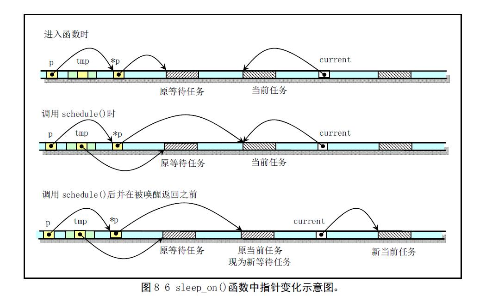
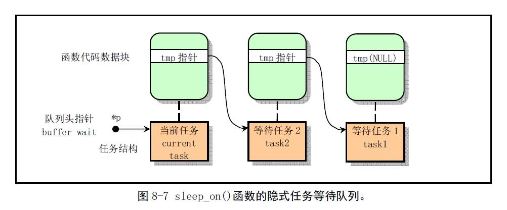

### 实验目的

- 加深对进程同步与互斥概念的认识；
- 掌握信号量的使用，并应用它解决生产者——消费者问题；
- 掌握信号量的实现原理。

### 实验过程

1. ubuntu中编写`pc.c`

查询`sem_open()`、`sem_close()`、`sem_wait()` 和 `sem_post()`的用法，在网上或者其他系统编程的书里看下。

在 Linux 下使用 C 语言，可以通过三种方法进行文件的读写：
- 使用标准 C 的 `fopen()`、`fread()`、`fwrite()`、`fseek()` 和 `fclose()` 等；
- 使用系统调用 `open()`、`read()`、`write()`、`lseek()` 和 `close()` 等；
- 通过内存镜像文件，使用 `mmap()` 系统调用。
- 在 Linux 0.11 上只能使用前两种方法。

`fork()` 调用成功后，子进程会继承父进程拥有的大多数资源，包括父进程打开的文件。所以子进程可以直接使用父进程创建的文件指针/描述符/句柄，访问的是与父进程相同的文件。

使用标准 C 的文件操作函数要注意，它们使用的是进程空间内的文件缓冲区，父进程和子进程之间不共享这个缓冲区。因此，任何一个进程做完写操作后，必须 `fflush()` 一下，将数据强制更新到磁盘，其它进程才能读到所需数据。

建议直接使用系统调用进行文件操作。

注意要`wait()`子进程，否则会成为孤儿进程被init接管。


2. 0.11中怎么实现的信号量
0.11实现原子操作保护临界区的方法是关中断(只能用于单核)，比如下面对磁盘操作的代码：
> kernel/blk_drv/ll_rw_blk.c

```c
static inline void lock_buffer(struct buffer_head * bh)
{
    // 关中断
    cli();

    // 将当前进程睡眠在 bh->b_wait
    while (bh->b_lock)
        sleep_on(&bh->b_wait);
    bh->b_lock=1;
    // 开中断
    sti();
}

static inline void unlock_buffer(struct buffer_head * bh)
{
    if (!bh->b_lock)
        printk("ll_rw_block.c: buffer not locked\n\r");
    bh->b_lock = 0;

    // 唤醒睡眠在 bh->b_wait 上的进程
    wake_up(&bh->b_wait);
}
```

`wake_up()`和`sleep_on()`的参数是`struct task_struct *`是进程 PCB 结构链表(睡眠链表)。
课程里面讲的`sleep_on()`就是只做一个事情：
1. 把自己放入等待队列
2. 修改状态为TASK_UNINTERRUPTIBLE(不可中断休眠)
3. 调用schedule()

下文中0.11的`sleep_on()`做了相同的事。

```c
// sleep_on()作用是把当前进程睡眠到睡眠队列里，主要要知道多个进程同时调用要怎么实现这个队列

// 把当前任务设置成不可中断状态，并让睡眠队列头指针指向当前任务
// 只有明确的唤醒才会返回。该函数提供了进程和中断处理程序之间的同步机制。
// p是等待队列的头指针。
void sleep_on(struct task_struct **p)
{
    struct task_struct *tmp;
    // 指针无效则退出 指针指向对象可以使NULL但是指针本身不可以
    // 也不能是任务0，这是没有意义的
    if (!p)
        return;
    if (current == &(init_task.task))
        panic("task[0] trying to sleep");
// 将当前task加入队列
// 在几个进程为等待同一资源而多次调用该函数时，程序就隐式地构筑出一个等待队列。
    tmp = *p;     // 将当前的队列头放到当前进程的栈中，current pcb就包含了下个任务的节点
    *p = current; // 将current加入队列头
    current->state = TASK_UNINTERRUPTIBLE;  // 修改状态
    schedule(); // 调度
// 调度返回 如果栈中含有tmp则唤醒 唤醒表示标志为可以调度
    if (tmp)
        tmp->state=0;
}

// wake_up实现进程的唤醒
// 唤醒后进程就可以参与调度了然后从上文的schedule方法返回，然后依次唤醒沉睡队列的任务
void wake_up(struct task_struct **p)
{
    if (p && *p) {
        (**p).state=0;
        *p=NULL;
    }
}
```
下面两图摘自完全注释，解释了`sleep_on()`中队列的形成



队列的样子



代码过程:

```c
// 第一个进程进来发现队列是空，把自己放在头部
// 第二个进程进来发现队列不为空把自己放头部，然后把原来任务放在tmp
// ...
task1：sleep_on(&p)

{
tmp=NULL;  因为第一次调用，所以之前的等待队列为空

*p=current=task1;

schedule();  
if (tmp) task1被唤醒，schedule()返回，此时tmp==null,下面代码不执行。

tmp->state=0;

}

task2：sleep_on(&p)

{
tmp=task1; 

*p=current=task2;

schedule();
if (tmp) task2被唤醒，schedule()返回，执行下面代码，唤醒task1;

tmp->state=0;  

}

task3：sleep_on(&p)

{
tmp=task2;  

*p=current=task3;

schedule();
if (tmp)   调用wake_up()时首先唤醒task3，schedule()返回，执行下面代码，唤醒task2.

tmp->state=0;          

}
```

### 问题
1. 这样有什么问题？
```c
Producer()
{
    // 生产一个产品 item;

    // 空闲缓存资源
    P(Empty);

    // 互斥信号量
    P(Mutex);

    // 将item放到空闲缓存中;
    V(Mutex);

    // 产品资源
    V(Full);
}

Consumer()
{
    P(Full);
    P(Mutex);

    //从缓存区取出一个赋值给item;
    V(Mutex);

    // 消费产品item;
    V(Empty);
}
```

1. 假设Producer刚生产完一件商品，释放了Mutex，Mutex为1，此时缓存区满了，Empty为0；
2. 然后OS执行调度，若被Producer拿到CPU，它拿到Mutex，使Mutex为0，而Empty为0，Producer让出CPU，等待Consumer执行V(Empty)；
3. 而Consumer拿到CPU后，却要等待Producer执行V(Mutex)；
4. 两者相互持有对方需要的资源，造成死锁。
