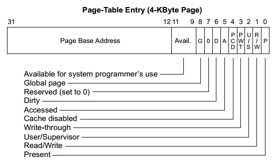

### 实验目的

- 深入理解操作系统的段、页式内存管理，深入理解段表、页表、逻辑地址、线性地址、物理地址等概念；
- 实践段、页式内存管理的地址映射过程；
- 编程实现段、页式内存管理上的内存共享，从而深入理解操作系统的内存管理。

### 实验内容
- 用 Bochs 调试工具跟踪 Linux 0.11 的地址翻译（地址映射）过程，了解 IA-32 和 Linux 0.11 的内存管理机制；
- 在 Ubuntu 上编写多进程的生产者—消费者程序，用共享内存做缓冲区；
- 在信号量实验的基础上，为 Linux 0.11 增加共享内存功能，并将生产者—消费者程序移植到 Linux 0.11。

### 实验过程
1. 调试跟踪`test.c`, 主要是理解分段分页的寻址过程。
```c
#include <stdio.h>

int i = 0x12345678;
int main(void)
{
    printf("The logical/virtual address of i is 0x%08x", &i);
    fflush(stdout);
    while (i)
        ;
    return 0;
}
```

使用asm调试器，按C继续运行进入linux shell，编译`test.c`并执行，启动后打印如下：
```text
The logical/virtual address of i is 0x00003004
```

```text
<bochs:3> u /8
10000063: (                    ): cmp dword ptr ds:0x3004, 0x00000000 ; 833d0430000000
1000006a: (                    ): jz .+0x00000004           ; 7404
1000006c: (                    ): jmp .+0xfffffff5          ; ebf5
1000006e: (                    ): add byte ptr ds:[eax], al ; 0000
10000070: (                    ): xor eax, eax              ; 31c0
10000072: (                    ): jmp .+0x00000000          ; eb00
10000074: (                    ): leave                     ; c9
10000075: (                    ): ret                       ; c3

这就是 test.c 中从 while 开始一直到 return 的汇编代码。变量 i 保存在 ds:0x3004 这个地址，并不停地和 0 进行比较，直到它为 0，才会跳出循环。
ds:0x3004 是虚拟地址，ds 表明这个地址属于 ds 段。首先要找到段表，然后通过 ds 的值在段表中找到 ds 段的具体信息，才能继续进行地址翻译。
```

每个在 IA-32 上运行的应用程序都有一个段表，叫 LDT，段的信息叫段描述符。段描述符就放在ldtr上

用sreg命令（这个可以在实验楼看）看到ldtr是`0x0068=0000000001101000`，GDT 的位置已经由 gdtr 明确给出，在**物理地址**的 0x00005cb8。

ldtr段选择子的意思如下


TI 0意思是段描述符在GDT表中，1的意思是段描述符在LDT中。RPL是请求特权级，需要用来跟CPL比较。
这里TI=0所以要在GDT中查找，而偏移量`0b1101 = 13`表示在GDT的13号位置。

根据GDT的物理地址算出偏移`0x00005cb8+13*8`得到LDT的段描述符。描述符结构:


其中位 P（Present）是段是否存在的标记；位 S 用来表示是系统段描述符（S=0）还是代码或数据段描述符（S=1）；四位 TYPE 用来表示段的类型，如数据段、代码段、可读、可写等；DPL 是段的权限，和 CPL、RPL 对应使用；位 G 是粒度，G=0 表示段限长以位为单位，G=1 表示段限长以 4KB 为单位

根据这个图可以拼接出基址

“0x**a2d0**0068 0x000082**fa**” 将其中的加粗数字组合为“0x00faa2d0”

通过这个地址`0x00faa2d0`可以拿到LDT的内容

同理sreg查找ds的段选择子`0x0017=0000000000010111`

可以看到特权级是3（因为在用户空间的代码）TI=1，是LDT描述符中的选择子。而偏移量是3，要找LDT的第三个描述符。

通过上面LDT的地址找到描述符为`0x00003fff 0x10c0f300`，并计算基址为0x10000000

段基址+段内偏移，就是线性地址了。所以 ds:0x3004 的线性地址就是：
```text
0x10000000 + 0x3004 = 0x10003004
```

**有了线性地址就可以查页表了**

多级页表格式如下:


首先需要算出线性地址中的页目录号、页表号和页内偏移，它们分别对应了 32 位线性地址的 10 位 + 10 位 + 12 位，所以 0x10003004 的页目录号是 64，页号 3，页内偏移是 4。

IA-32 下，页目录表的位置由 CR3 寄存器指引。通过CR3可以查到页目录表的物理地址

0.11页目录只有一个，高版本的系统是一个进程一个页目录表。

页表和页目录表结构如下:




【P】：存在位。为1表示页表或者页位于内存中。否则，表示不在内存中，必须先予以创建或者从磁盘调入内存后方可使用。

【R/W】：读写标志。为1表示页面可以被读写，为0表示只读。当处理器运行在0、1、2特权级时，此位不起作用。页目录中的这个位对其所映射的所有页面起作用。

【U/S】：用户/超级用户标志。为1时，允许所有特权级别的程序访问；为0时，仅允许特权级为0、1、2的程序访问。页目录中的这个位对其所映射的所有页面起作用。

【PWT】：Page级的Write-Through标志位。为1时使用Write-Through的Cache类型；为0时使用Write-Back的Cache类型。当CR0.CD=1时（Cache被Disable掉），此标志被忽略。对于我们的实验，此位清零。

【PCD】：Page级的Cache Disable标志位。为1时，物理页面是不能被Cache的；为0时允许Cache。当CR0.CD=1时，此标志被忽略。对于我们的实验，此位清零。

【A】：访问位。该位由处理器固件设置，用来指示此表项所指向的页是否已被访问（读或写），一旦置位，处理器从不清这个标志位。这个位可以被操作系统用来监视页的使用频率。

【D】：脏位。该位由处理器固件设置，用来指示此表项所指向的页是否写过数据。

【PS】：Page Size位。为0时，页的大小是4KB；为1时，页的大小是4MB（for normal 32-bit addressing ）或者2MB（if extended physical addressing is enabled).

【G】：全局位。如果页是全局的，那么它将在高速缓存中一直保存。当CR4.PGE=1时，可以设置此位为1，指示Page是全局Page，在CR3被更新时，TLB内的全局Page不会被刷新。

【AVL】：被处理器忽略，软件可以使用。

通过页目录表的物理地址算出偏移，`0 + 64*4`得到叶框号0x00faa027

其中的 027 是属性，显然 P=1。为1表示页表或者页位于内存中

再通过页框+偏移`0x00faa000+3*4`求得0x00fa7067  其中的 067 是属性，显然 P=1

线性地址 0x10003004 对应的物理页框号为 0x00fa7，和页内偏移 0x004 接到一起，得到 0x00fa7004，这就是变量 i 的物理地址。

2. 编写`ubuntu_pc.c`，使用共享内存充当队列

3. 在 Linux 0.11 中实现共享内存（使用shmget()、shmat() 和 shmdt()的组合）

需要实现获得物理页面
```c
// kernel/fork.c
int copy_process(…)
{
    struct task_struct *p;
    p = (struct task_struct *) get_free_page();
    if (!p)
        return -EAGAIN;
//    ……
}

// mm/memory.c
// 从mem_map 获得一个没有被引用的页
unsigned long get_free_page(void)
{
    register unsigned long __res asm("ax");
    __asm__("std ; repne ; scasb\n\t"
            "jne 1f\n\t"
            "movb $1,1(%%edi)\n\t"
            // 页面数*4KB=相对页面起始地址
            "sall $12,%%ecx\n\t"
            // 在加上低端的内存地址，得到的是物理起始地址
            "addl %2,%%ecx\n\t"
            "movl %%ecx,%%edx\n\t"
            "movl $1024,%%ecx\n\t"
            "leal 4092(%%edx),%%edi\n\t"
            "rep ; stosl\n\t"
            //edx赋给eax，eax返回了物理起始地址
            "movl %%edx,%%eax\n"
            "1:" :"=a" (__res) :"0" (0),"i" (LOW_MEM),"c" (PAGING_PAGES),
            "D" (mem_map+PAGING_PAGES-1):"di","cx","dx");
    return __res;
}

static unsigned char mem_map [ PAGING_PAGES ] = {0,};
```

地址映射

在0.11中虚拟内存是64M一段，每个进程一段连续的分布，因此要在这64M内存中找到一段可以用的虚存地址映射到物理页

有了空闲物理页面，也有了建立线性地址和物理页面的映射，但要完成本实验还需要能获得一段空闲的虚拟地址空闲。

要从数据段中划出一段空间，首先需要了解进程数据段空间的分布，而这个分布显然是由 exec 系统调用决定的，所以要详细看一看 exec 的核心代码，do_execve（在文件 fs/exec.c 中）。

在函数 do_execve() 中，修改数据段（当然是修改 LDT）的地方是 change_ldt，函数 change_ldt 实现如下：

```c
static unsigned long change_ldt(unsigned long text_size,unsigned long * page)
{
    /*其中text_size是代码段长度，从可执行文件的头部取出，page为参数和环境页*/
    unsigned long code_limit,data_limit,code_base,data_base;
    int i;

    code_limit = text_size+PAGE_SIZE -1;
    code_limit &= 0xFFFFF000;
    //code_limit为代码段限长=text_size对应的页数（向上取整）
    data_limit = 0x4000000; //数据段限长64MB
    code_base = get_base(current->ldt[1]);
    data_base = code_base;

    // 数据段基址 = 代码段基址
    set_base(current->ldt[1],code_base);
    set_limit(current->ldt[1],code_limit);
    set_base(current->ldt[2],data_base);
    set_limit(current->ldt[2],data_limit);
    __asm__("pushl $0x17\n\tpop %%fs":: );

    // 从数据段的末尾开始
    data_base += data_limit;

    // 向前处理
    for (i=MAX_ARG_PAGES-1 ; i>=0 ; i--) {
        // 一次处理一页
        data_base -= PAGE_SIZE;
        // 建立线性地址到物理页的映射
        if (page[i]) put_page(page[i],data_base);
    }
    // 返回段界限
    return data_limit;
}
```

虚存分布如下: 


虚存内分布如下: 


由上面的图以及代码可以分析出虚存开始的位置就是ldt[1] = code_base = PCB.start_code

为什么PCB.start_code也是可以看这一段代码:
```c
int copy_mem(int nr,struct task_struct * p)
{
    unsigned long old_data_base,new_data_base,data_limit;
    unsigned long old_code_base,new_code_base,code_limit;

    //0x0f为代码段选择子
    //下面有对段选择子的说明
    code_limit=get_limit(0x0f);
    //0x17为数据段选择子
    data_limit=get_limit(0x17);
    //下面有重点分析
    old_code_base = get_base(current->ldt[1]);
    old_data_base = get_base(current->ldt[2]);
    if (old_data_base != old_code_base)
        panic("We don't support separate I&D");
    if (data_limit < code_limit)
        panic("Bad data_limit");
    //进程线形地址的基地址为 64M X 进程号
    new_data_base = new_code_base = nr * TASK_SIZE;
    p->start_code = new_code_base;
    //设置ldt[1]代码段的线性地址
    set_base(p->ldt[1],new_code_base);
    //设置ldt[2]数据段的线性地址
    set_base(p->ldt[2],new_data_base);
    //拷贝页表,在内存管理中详细说明
    if (copy_page_tables(old_data_base,new_data_base,data_limit)) {
        free_page_tables(new_data_base,data_limit);
        return -ENOMEM;
    }
    return 0;
}

```

brk = 代码 + 数据 + bss， brk后面的区域是堆区，可以用做映射的地址区。

知道了上面的内容就可以实现系统调用shm了

```c
#include <asm/segment.h>
#include <linux/kernel.h>
#include <unistd.h>
#include <string.h>
#include <linux/sched.h>

#define SHM_COUNT 20
#define SHM_NAME_SIZE 20

struct struct_shm_tables
{
	int occupied;
	char name[SHM_NAME_SIZE];
	long addr;
} shm_tables[SHM_COUNT];

int find_shm_location(char *name)
{
	int i;
	for(i=0; i<SHM_COUNT; i++)
	{
		if(!strcmp(name,shm_tables[i].name) && shm_tables[i].occupied ==1)
		{
			return i;
		}
	}
	return -1;
}

int sys_shmget(char * name)
{
	int i,shmid;
	char tmp[SHM_NAME_SIZE];
	for(i=0; i<SHM_NAME_SIZE; i++)
	{
		tmp[i] = get_fs_byte(name+i);
		if(tmp[i] == '\0') break;
	}
	shmid = find_shm_location(tmp);
	if( shmid != -1) 
	{
		return shmid;
	}
	for(i=0; i<SHM_COUNT; i++)
	{
		if(shm_tables[i].occupied == 0)
		{
			strcpy(shm_tables[i].name,tmp);
			shm_tables[i].occupied = 1;
			shm_tables[i].addr = get_free_page();
			return i;
		}
	}
	printk("SHM Number limited!\n");
	return -1;
}

void * sys_shmat(int shmid)
{
	if(shm_tables[shmid].occupied != 1)
	{
		printk("SHM not exists!\n");
		return -1;
	}
	put_page(shm_tables[shmid].addr,current->brk + current->start_code);
	return (void*)current->brk;
}
```

最后实现`consumer.c`和`producer.c`，这里不知道为神马程序最后老是卡在那里。